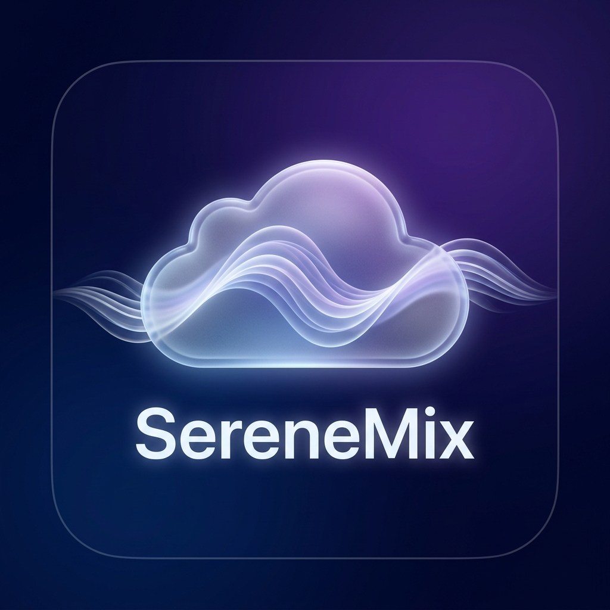
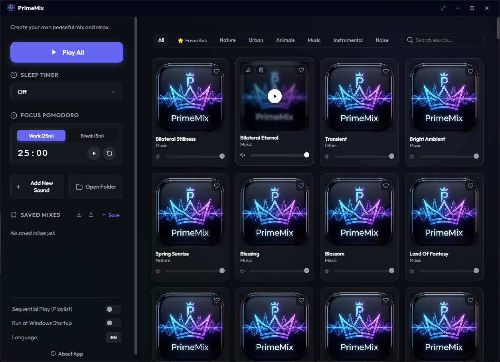
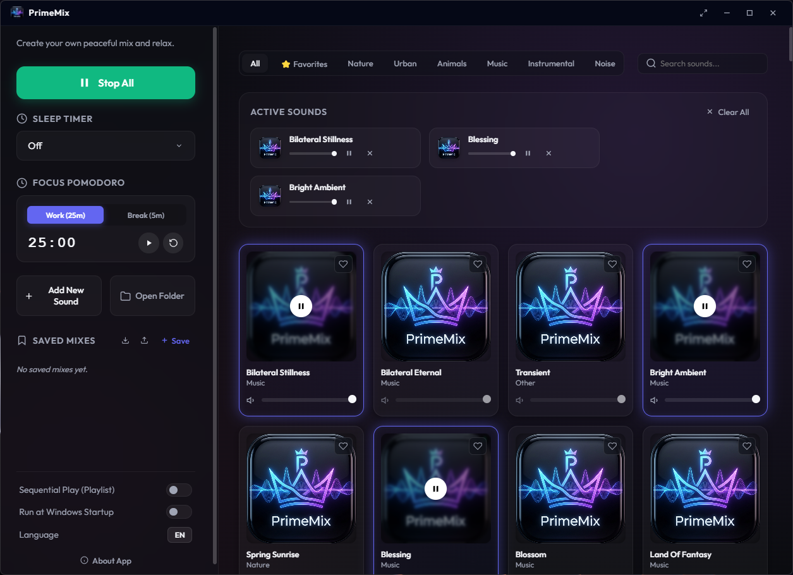
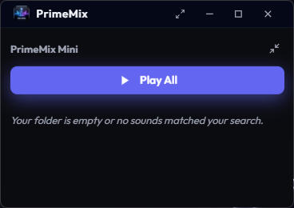
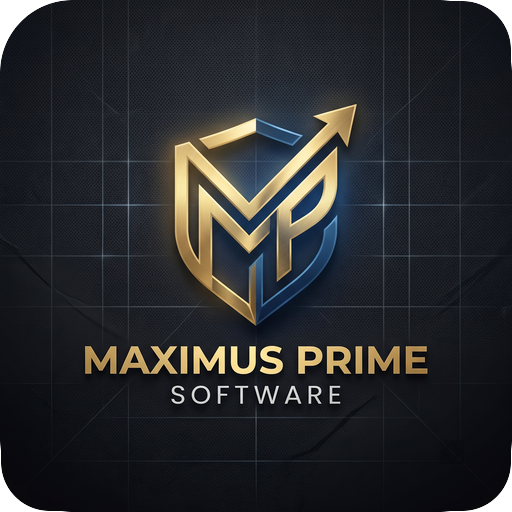

<p align="center">
  
</p>

<h1 align="center">PrimeMix</h1>

<p align="center">
  <strong>A modern ambient sound mixer for focus, relaxation, and sleep.</strong>
</p>

<p align="center">
  
  
  
  <a href="LICENSE"></a>
</p>

<p align="center">
  <a href="#features">Features</a> •
  <a href="#screenshots">Screenshots</a> •
  <a href="#installation">Installation</a> •
  <a href="#development">Development</a> •
  <a href="#audio-library-and-licensing">Audio Licensing</a>
</p>

---

PrimeMix is a privacy-friendly Windows desktop application for creating personal ambient soundscapes. Import audio you are authorized to use, combine up to three sounds, control each track independently, save reusable mixes, and stay productive with integrated sleep and Pomodoro timers.

The application runs locally. It does not require an account, cloud service, or permanent internet connection.

> [!TIP]
> **Your sounds, your atmosphere.** PrimeMix lets every user build a personal library by importing MP3, WAV, OGG, FLAC, or M4A files directly from the application.

## Features

- **Bring Your Own Audio:** Add personal recordings, licensed music, or ambient sounds directly from the interface.
- Mix up to three ambient sounds simultaneously.
- Smooth fade-in, fade-out, and individual volume control.
- Sequential playlist mode with category and search filtering.
- Favorites and reusable saved mixes.
- Import and export mix configurations as JSON.
- Sleep timer from 15 minutes to 2 hours.
- Integrated 25/5 Pomodoro focus timer.
- Compact always-on-top mini player.
- Editable titles, categories, and cover images.
- Real-time sound-folder synchronization.
- English and Turkish interface support.
- Windows system tray and global media controls.
- Optional launch at Windows startup.
- Local-first operation with no telemetry or cloud dependency.

## Screenshots

### Main interface

<p align="center">
  
</p>

### Active sound mixer

<p align="center">
  
</p>

### Mini player

<p align="center">
  
</p>

## Installation

PrimeMix is distributed for 64-bit Windows in two formats:

- `PrimeMix-1.0.0-win.zip` — recommended portable folder distribution.
- `PrimeMix 1.0.0.exe` — single-file portable executable.

Download a release from the repository's **Releases** page. For the ZIP edition, extract the archive before launching `PrimeMix.exe`.

> [!NOTE]
> Official PrimeMix builds do not bundle third-party audio. Add only audio that you created or are licensed to use.

## Adding sounds

Use **Add New Sound** inside PrimeMix, or place supported files in the application sound directory.

Supported formats:

- MP3
- WAV
- OGG
- FLAC
- M4A

During development, PrimeMix uses the local `PrimeMixSound` directory. Packaged builds create and use a `PrimeMix_Data` directory beside the application.

## Audio library and licensing

PrimeMix deliberately ships without third-party sound files. This keeps the application distribution legally clear and gives users control over their own libraries.

For an audio file to be included in an official build, it must be:

- an original recording or production owned by Maximus Prime Software;
- explicitly released under CC0 1.0; or
- covered by written permission allowing commercial use and redistribution.

See [AUDIO_SOURCING_GUIDE.md](AUDIO_SOURCING_GUIDE.md) for the full acceptance process. License records and evidence templates are stored under [`licenses/`](licenses/).

## Development

### Requirements

- Windows 10 or later
- Node.js 22 or later
- npm

### Setup

```powershell
git clone https://github.com/MaximusPrime/PrimeMix.git
cd PrimeMix
npm install
npm start
```

### Quality checks

```powershell
npm run check
npm audit
```

### Build

```powershell
npm run build
```

Build artifacts are written to `dist/`. This directory is intentionally excluded from source control; publish distributable files through GitHub Releases.

## Security

PrimeMix uses Electron security boundaries including context isolation, renderer sandboxing, a restrictive Content Security Policy, validated IPC senders, constrained local-media access, and path-containment checks for file operations.

If you discover a security issue, contact [maximusprimesoftware@gmail.com](mailto:maximusprimesoftware@gmail.com) instead of opening a public issue containing sensitive details.

## Project structure

```text
PrimeMix/
├── assets/                  # Maximus Prime Software branding
├── licenses/                # Audio license inventory and evidence
├── renderer/                # HTML, CSS, renderer logic, and locales
├── screenshots/             # Repository screenshots
├── scripts/                 # Automated quality checks
├── AUDIO_SOURCING_GUIDE.md  # Audio acceptance and licensing policy
├── main.js                  # Electron main process
├── preload.js               # Restricted IPC bridge
└── package.json             # Scripts, dependencies, and build config
```

## License

The PrimeMix source code is released under the [MIT License](LICENSE).

Audio files imported by users remain subject to their respective licenses. The MIT License for the application does not grant rights to third-party audio.

## Publisher

<p align="center">
  <a href="https://maximusprimesoftware.pages.dev/">
    
  </a>
</p>

<p align="center">
  <strong>Published by Maximus Prime Software</strong><br>
  Designed and developed by <strong>Maximus Prime</strong><br>
  <a href="https://maximusprimesoftware.pages.dev/">Official website</a> ·
  <a href="https://maximusprimesoftware.pages.dev/projects/primemix/">Product page</a><br>
  <a href="mailto:maximusprimesoftware@gmail.com">maximusprimesoftware@gmail.com</a> ·
  <a href="https://github.com/MaximusPrime">@MaximusPrime</a> ·
  <a href="https://github.com/MaximusPrime/PrimeMix">Repository</a>
</p>
